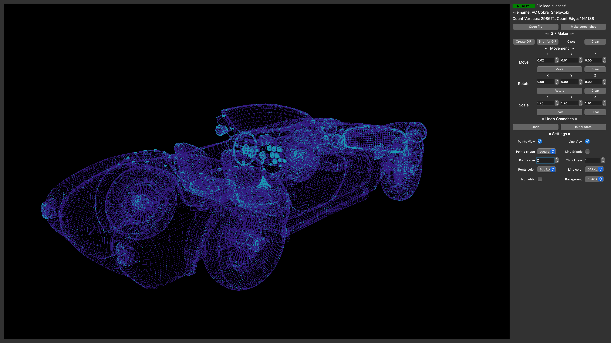

# CPP_3DViewer
3D wireframe Viewer C++ 
Desktop gui application for viewing 3D models.
The features:
1) User can move, rotate, scale object with mouse or with the buttons on the main panel.
2) Application counts vertices and edges. 
3) Application has undo interface (provided by patterns: commands, memento).
4) User can make photos and gifs of the model.
Project uses OpenGL libraries for visualisation .obj files.

Before executing application please:
1) // Clone the project //
2) // Go to the src directory //
2) // execute the command in the shell terminal: // make install - the programm will build and the icon will be on the desktop.

 
